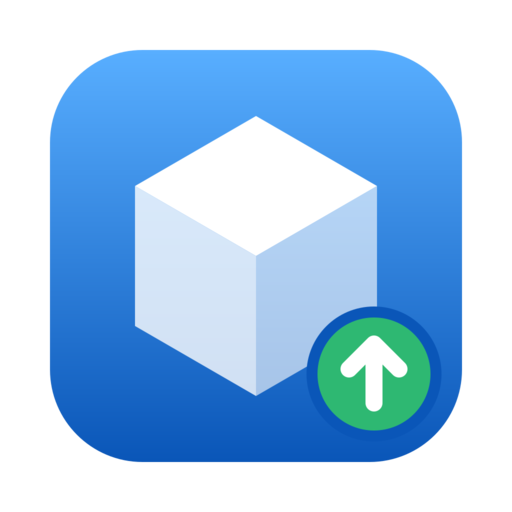
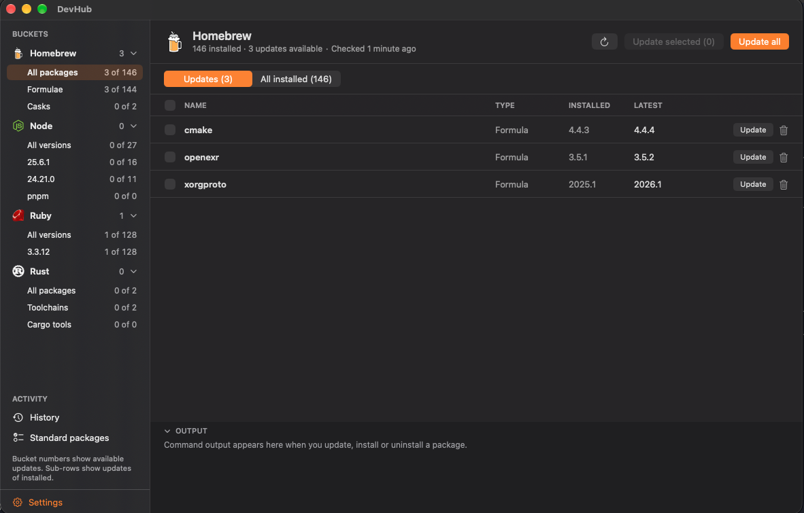
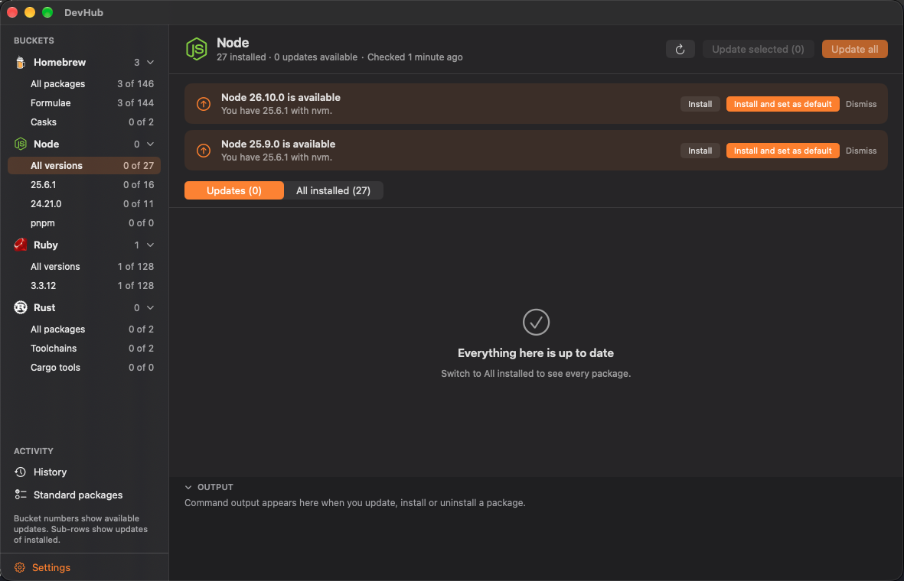
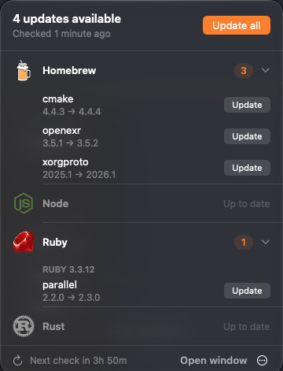
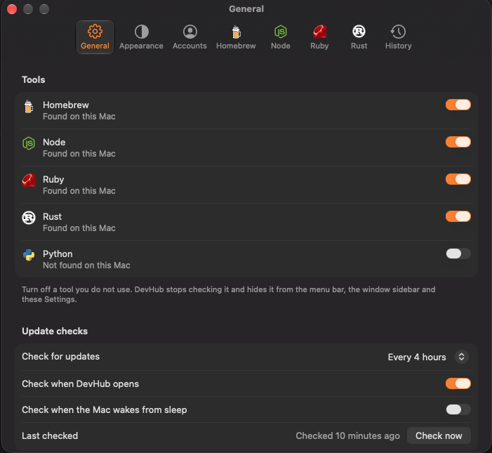
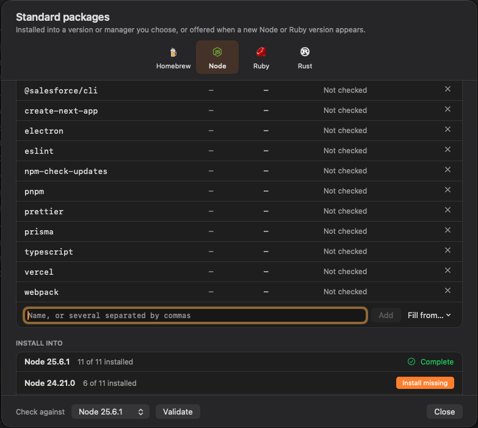
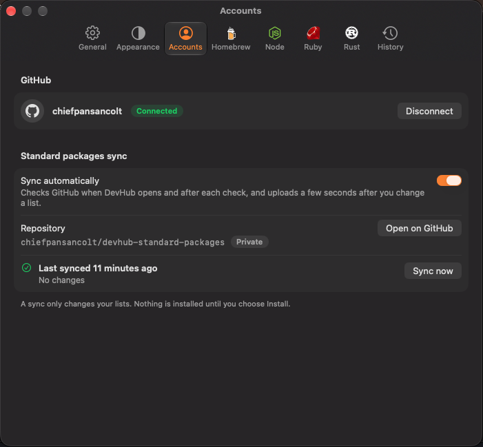

# DevHub

<div align="center">
  
  <h3>One place to keep Homebrew, Node, Ruby, Rust and Python up to date</h3>
  <p>A macOS menu bar app that shows what is outdated and updates it for you</p>
  <p><a href="https://devhub.chiefpansancolt.dev">devhub.chiefpansancolt.dev</a></p>

[](https://github.com/chiefpansancolt/devhub/actions/workflows/ci.yml)
[](https://codecov.io/gh/chiefpansancolt/devhub)


</div>

---

## 📸 Screenshots

<div align="center">
  
  <p><em>The window, with a sidebar that filters by tool, Node version and Ruby version</em></p>
</div>

<div align="center">
  
  <p><em>A newer Node version, offered with Install or Install and set as default</em></p>
</div>

<table align="center">
  <tr>
    <td align="center" valign="top">
      <br>
      <em>The menu bar popover</em>
    </td>
    <td align="center" valign="top">
      <br>
      <em>Settings</em>
    </td>
  </tr>
  <tr>
    <td align="center" valign="top">
      <br>
      <em>Standard packages, with the versions that are missing some of them</em>
    </td>
    <td align="center" valign="top">
      <br>
      <em>Sync with GitHub in Settings</em>
    </td>
  </tr>
</table>

---

## ✨ Features

### 📦 Five tools in one list

- **Homebrew** formulae and casks
- **Node** global packages, kept separate for every Node version you have installed, plus the global packages of pnpm, Bun and Yarn 1
- **Ruby** gems, kept separate for every Ruby version you have installed
- **Rust** toolchains, rustup itself, and the tools installed with `cargo install`
- **Python** tools installed with pipx and with uv, listed by manager

DevHub finds your versions through nvm, fnm, Volta and asdf for Node, and through RVM, rbenv, chruby and asdf for Ruby. The macOS system Ruby is left out on purpose, because its gems need `sudo`. DevHub finds Rust through rustup, in `~/.cargo/bin` or in Homebrew, finds pnpm, Bun and Yarn in their own folders and in the `bin` folder of your Node versions, and finds pipx and uv in `~/.local/bin`, in `~/.cargo/bin` (uv) and in Homebrew. If a tool is not in a usual place, choose its folder or program in Settings.

### 🔄 Updating

- Update everything, update a selection, update one package, or uninstall one package
- A progress strip shows the package that is running, how many are done and how long it has run, with a Cancel button
- The output log shows the command and everything it prints as it happens
- A failed update shows the reason, with Try again and Dismiss
- For Node, DevHub installs the highest version that each Node version supports, instead of blindly using `@latest`, because npm installs a version that cannot run and only prints a warning

### 📋 Standard packages

Keep one list of the packages you always want, for Homebrew, Node, Ruby, Rust and Python, in the **Standard Packages** window under the DevHub menu. **Validate** checks that every package exists and shows the version that would install, and for Node the newest version that the chosen Node version can run. **Install missing** installs what a Node version, a Ruby version, a package manager or this Mac is missing. When a new Node or Ruby version appears, DevHub offers the list in a banner and can tell you with a notification. It never installs until you choose Install.

**File ▸ Export Standard Packages** writes the lists to one JSON file, and **File ▸ Import Standard Packages** reads such a file on another Mac. An import asks whether to merge the names into your lists or replace them, shows what changes for each tool, and installs nothing. Install from the window afterwards.

### ⬆️ New Node and Ruby versions

When a version manager owns your Node or Ruby, DevHub looks up the newest release once a day and shows a banner when a version is missing: a newer major version, or a newer patch of a line you already have. Each banner has two buttons: **Install** runs the manager's own install command, and **Install and set as default** also makes that version the default. Both show the usual progress, Cancel and history. nvm, fnm, Volta and asdf are supported for Node, and rbenv, rvm and asdf for Ruby. Ruby builds from source and takes several minutes. Turn the check off in the Node or Ruby tab of Settings.

A version can also be removed. Select a Node or Ruby version in the sidebar and choose the trash button in the header, or right-click the version and choose Uninstall. DevHub always asks first, even when confirmations are off for packages, because a version holds all of its global packages. nvm, fnm and asdf (Node) and rbenv, rvm and asdf (Ruby) can do this. Volta, chruby and custom folders cannot, so they show no button.

### 🔄 Sync your standard packages with GitHub

Connect a GitHub account in **Settings ▸ Accounts** and DevHub keeps your standard packages lists the same on every Mac. It signs in with GitHub's device flow: DevHub shows a code, you enter it at github.com/login/device, and no password or secret passes through DevHub. It then creates a private repository named `devhub-standard-packages` in your account, with one file, `standard-packages.json`, that holds only the package names. A second Mac finds the same repository and joins it.

Each Mac keeps the lists as they were at its last sync, so a name you remove on one Mac is removed on the others, and names you add on two Macs are both kept. DevHub syncs when it opens, after each check and when the Mac wakes, and uploads a few seconds after you edit a list. **Sync now** and a **Sync automatically** switch are in the same tab. A sync only changes your lists and never installs anything. If the file on GitHub was written by a newer DevHub, DevHub does not overwrite it and asks you to update.

GitHub only offers one permission that can create a private repository, `repo`, which can read and write all of your private repositories. DevHub uses it for the one repository, and the Accounts tab says so before you connect. The token is kept in your keychain, and you can revoke it at any time at github.com/settings/applications.

### 🧾 History

Every check, update and uninstall is written to `~/Library/Logs/DevHub/history.jsonl`, one JSON object per line, with the time, the command, the exit code and the output. The History page groups entries by day, filters them, and exports them. You can keep history for 30 days, 90 days, a year or forever.

### 🔔 Notifications and checks

- Check every hour, every 4 hours, once a day, or only when you ask
- Check when DevHub opens and, if you want, when the Mac wakes from sleep
- Be told about every new update, get a once a day summary, or hear only about major versions
- Choose the menu bar icon style: icon, icon and count, or count only

### 🌍 Made for everyone

- Light and dark mode, or follow the system
- Nine languages (see [Languages](#-languages))
- VoiceOver labels, keyboard navigation in the lists, and a layout that mirrors for right-to-left languages
- The pointing hand on everything you can click

---

## ⬇️ Installation

DevHub needs macOS 15 (Sequoia) or newer, on Apple Silicon or Intel. It works with whichever of Homebrew, Node, Ruby, Rust and Python tools you have.

### Download

Download the latest `.dmg` from the [Releases](https://github.com/chiefpansancolt/devhub/releases) page, open it, and drag DevHub to Applications. A `.sha256` file is attached to each release.

DevHub is signed ad hoc and is not notarized yet, so macOS blocks it the first time it runs from a download. To open it once:

1. Open DevHub. macOS says it cannot verify the app.
2. Open System Settings, then Privacy & Security, scroll down and choose **Open Anyway** next to DevHub.

Or remove the quarantine flag from a terminal:

```bash
xattr -dr com.apple.quarantine /Applications/DevHub.app
```

### Build from source

```bash
brew install xcodegen
git clone https://github.com/chiefpansancolt/devhub.git
cd devhub
make run
```

An app built on your own Mac is not quarantined and opens without the steps above.

---

## ⌨️ Keyboard Shortcuts

| Shortcut | Action                          |
| -------- | ------------------------------- |
| `⌘R`     | Check everything again          |
| `⇧⌘U`    | Update all                      |
| `⌥⌘U`    | Update the selected packages    |
| `⌘U`     | Update the open package         |
| `⌃⌘⌫`    | Uninstall the open package      |
| `⌥⌘A`    | Select all updates              |
| `⇧⌘C`    | Copy the package name           |
| `⌘F`     | Find an installed package       |
| `⌘1`     | Show Homebrew                   |
| `⌘2`     | Show Node                       |
| `⌘3`     | Show Ruby                       |
| `⌘4`     | Show Rust                       |
| `⌘5`     | Show Python                     |
| `⌥⌘1`    | Show updates                    |
| `⌥⌘2`    | Show all installed packages     |
| `⌘6`     | Show History                    |
| `⌥⌘I`    | Show or hide the details pane   |
| `⌥⌘L`    | Show or hide the output log     |
| `⌘,`     | Open Settings                   |
| `↑` `↓`  | Move through a list             |
| `Esc`    | Close the details pane          |

---

## ⚙️ How it works

DevHub runs the tools you already have and reads what they print. It does not use a private index. The only requests it makes itself are two plain downloads of the public release lists on nodejs.org and ruby-lang.org, at most once a day, to learn about new Node and Ruby versions (a switch in Settings turns that off for each tool), and, only if you connect a GitHub account, the sync of your standard packages lists with the GitHub API.

| Tool     | What DevHub runs                                                                                          |
| -------- | --------------------------------------------------------------------------------------------------------- |
| Homebrew | `brew update` (optional), `brew info --json=v2 --installed`, `brew outdated --json=v2`, `brew upgrade`, `brew uninstall` |
| Node     | `npm ls -g --depth=0 --json`, `npm outdated -g --json`, `npm view`, `npm install -g <name>@<version>`, `npm uninstall -g` |
| Ruby     | `gem list --local`, `gem outdated`, `gem update --no-document`, `gem uninstall --all --executables`       |
| pnpm, Bun, Yarn | `pnpm list -g --json`, `pnpm outdated -g`, `pnpm add -g`, `pnpm remove -g`, `bun pm ls -g`, `bun outdated -g`, `bun add -g`, `bun remove -g`, `yarn global list`, `yarn global dir`, `yarn outdated --json`, `yarn global add`, `yarn global remove` |
| Python   | `pipx list --json`, `pipx runpip <tool> list --outdated --format=json`, `pipx upgrade`, `pipx uninstall`, `uv tool list`, `uv tool list --outdated --show-version-specifiers`, `uv tool upgrade`, `uv tool uninstall` |
| Installing | `brew install`, `npm install -g name@version`, `gem install`, `rustup toolchain install`, `cargo install --locked`, `pipx install`, `uv tool install`, `pnpm add -g`, `bun add -g`, `yarn global add`. Checks use `brew info`, `npm view`, `gem list --remote`, `cargo search` and `pip index versions` |
| Version managers | `nvm install`, `nvm alias default`, `fnm install`, `fnm default`, `volta install`, `volta fetch`, `asdf install`, `asdf set --home`, `asdf global`, `rbenv install`, `rbenv global`, `rvm install`, `nvm uninstall`, `fnm uninstall`, `asdf uninstall`, `rbenv uninstall`, `rvm uninstall` |
| GitHub sync | `POST github.com/login/device/code` and `POST github.com/login/oauth/access_token` to sign in, then `GET /user`, `GET` and `POST /user/repos`, and `GET` and `PUT /repos/<you>/devhub-standard-packages/contents/standard-packages.json` on api.github.com |
| Rust     | `rustup toolchain list -v`, `rustup check`, `rustup update`, `rustup self update`, `rustup toolchain uninstall`, `cargo install --list`, `cargo search`, `cargo install --locked`, `cargo uninstall` |

For Node and Ruby, DevHub runs the `npm` or `gem` that belongs to each version, with that version's `bin` folder first in `PATH`. For pnpm, Bun and Yarn, DevHub installs the exact newest version by name, because their update commands stay inside the version range that a package was installed with, and it does not check the `engines` of a package. Yarn 2 and newer has no global packages and is skipped. For Rust, `cargo search` asks crates.io for the newest version of each Cargo tool, and a tool installed from Git or a folder is listed without an update check. For Python, pipx and uv ask PyPI for the newest version of each tool, and a uv tool pinned to a version or capped below the newest one shows no update. It runs one Homebrew command at a time, because Homebrew locks its files. It never uses `sudo` and never asks for an administrator password, so a package that needs elevated rights fails and says why.

### Your data

- History is a plain text file at `~/Library/Logs/DevHub/history.jsonl`. Open it, export it, or clear it from the History page.
- Settings are stored in the app's preferences.
- Nothing is sent anywhere, except the names in your standard packages lists when you connect a GitHub account, which go to your own private repository.

---

## 🛠️ Development

### Requirements

- macOS 15 or newer
- Xcode
- [XcodeGen](https://github.com/yonaskolb/XcodeGen) (`brew install xcodegen`)

### Commands

```bash
make help            # list every target
make test            # run the DevHubCore tests
make coverage        # run the tests with code coverage and write coverage.lcov
make build           # generate the project and build a universal binary into ./build
make run             # build and open the app
make scan            # print the outdated packages found on this Mac
make check-strings   # check that every string is translated into every language
make release         # build dist/DevHub-<version>.dmg and its checksum
```

`make build` always uses the `generic/platform=macOS` destination so that the binary is universal.

### Project structure

```text
├── DevHub/                      # The app
│   ├── Views/
│   │   ├── Popover/             # The menu bar popover
│   │   ├── Window/              # The main window, details pane and History
│   │   └── Settings/            # The eight Settings tabs
│   ├── DevHubApp.swift          # App entry point and scenes
│   ├── DevHubCommands.swift     # Application menus and shortcuts
│   └── Localizable.xcstrings    # App strings
├── Packages/DevHubCore/         # Logic with no SwiftUI, covered by tests
│   ├── Sources/DevHubCore/
│   │   ├── Commands/            # Runs commands and streams their output
│   │   ├── Scanners/            # Homebrew, Node, Ruby, Rust and Python scanners
│   │   ├── Parsing/             # Reads brew, npm, gem, rustup, cargo, pipx and uv output
│   │   ├── Discovery/           # Finds Homebrew, Node, Ruby, Rust and Python installs
│   │   ├── State/               # AppState, the single source of truth
│   │   ├── History/             # The JSON Lines history log
│   │   ├── Settings/            # Settings values and storage
│   │   └── Notifications/       # Deciding what to announce
│   └── Tests/                   # Swift Testing, with recorded command output
├── scripts/                     # Release and localization scripts
├── project.yml                  # XcodeGen project definition
└── Makefile
```

The Xcode project is generated from `project.yml` and is not committed. The tests use recorded output from real `brew`, `npm`, `gem`, `rustup`, `cargo`, `pipx` and `uv` runs, and never run the real tools.

---

## 🌍 Languages

DevHub is translated into German, Spanish, French, Brazilian Portuguese, Russian, Japanese, Korean and Simplified Chinese, and the language can be changed in Settings, under Appearance. English is the source language. The translations have not had a native review yet, so corrections are welcome.

Strings live in two String Catalogs: `DevHub/Localizable.xcstrings` for the app and `Packages/DevHubCore/Sources/DevHubCore/Resources/Localizable.xcstrings` for messages from the core.

After you add or change a string in the code, run `make build`, then update the catalogs from what the compiler found:

```bash
args() { for f in $(find build -path "$1" -name "*.stringsdata" | grep -v Extracted); do printf -- '--stringsdata %s ' "$f"; done; }
xcrun xcstringstool sync DevHub/Localizable.xcstrings $(args "*DevHub.build/Debug/DevHub.build/Objects-normal/arm64*")
xcrun xcstringstool sync Packages/DevHubCore/Sources/DevHubCore/Resources/Localizable.xcstrings $(args "*DevHubCore.build*Objects-normal/arm64*")
```

Then open the catalogs in Xcode to translate the new strings, and run `make check-strings`. To add a language, add it in the catalog editor and add its name to the language picker in `AppearanceSettingsView.swift`. To try a language without changing the Mac, run the app with `-AppleLanguages "(de)"`.

---

## 🩺 Troubleshooting

**macOS says DevHub cannot be opened.** The app is not notarized yet. See [Installation](#-installation) for the one-time steps.

**A tool says it was not found.** Open Settings, choose the tab for that tool, and choose its program or its folder of versions. For Rust, choose the `rustup` program, for Python, the `pipx` or `uv` program, and for the other Node package managers, the matching program in the Node tab.

**An update fails with a permission error.** DevHub runs everything as you and never uses `sudo`. Fix the ownership of the folder that npm or gem writes to, then choose Try again. The History page keeps the full output.

**An update seems stuck.** The progress strip shows how long the command has run. A slow or dropped network makes npm wait and retry for minutes. Choose Cancel and try again.

**Where is my history?** In `~/Library/Logs/DevHub/history.jsonl`. Choose **Show log in Finder** on the History page.

---

## 🗺️ Roadmap

- Developer ID signing and notarization, so the app opens with no warning
- Self updates with Sparkle
- A Homebrew cask
- Export the installed list
- A native review of every translation

The plan and the design mockups live in the private repository [devhub-plan](https://github.com/chiefpansancolt/devhub-plan).

---

## 🤝 Contributing

Bug reports, ideas, translations and pull requests are welcome. Read [CONTRIBUTING.md](.github/CONTRIBUTING.md) first, and note that everyone taking part follows the [Code of Conduct](.github/CODE_OF_CONDUCT.md). To report a security problem, follow [SECURITY.md](.github/SECURITY.md).

---

## 📈 Changelog

For the complete list of changes, see [CHANGELOG.md](CHANGELOG.md).

---

## 💖 Support the Project

If you find DevHub helpful, consider supporting its development:

<div align="center">

[](https://github.com/sponsors/chiefpansancolt)
[](https://ko-fi.com/chiefpansancolt)
[](https://patreon.com/chiefpansancolt)

</div>

---

## 📄 License

MIT License. See [LICENSE](LICENSE) for details.

---

<div align="center">
  <p>Built by <a href="https://chiefpansancolt.dev">chiefpansancolt</a></p>
</div>
